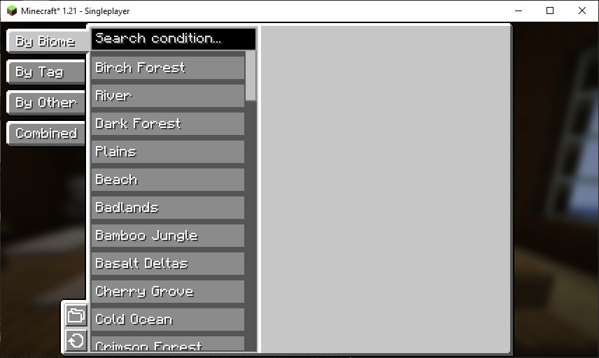
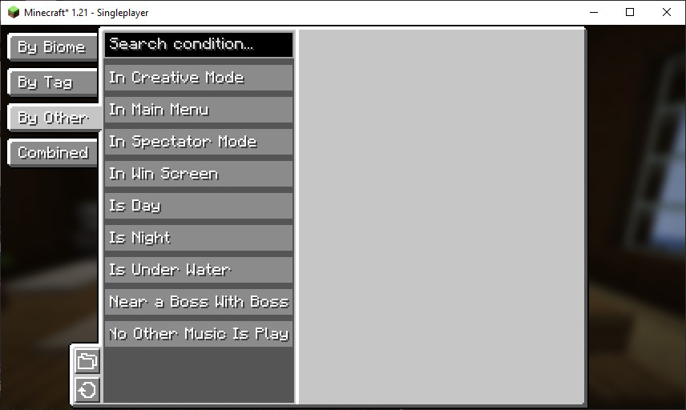
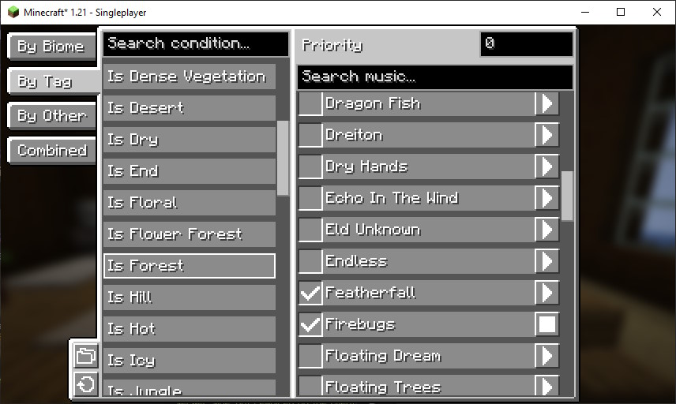
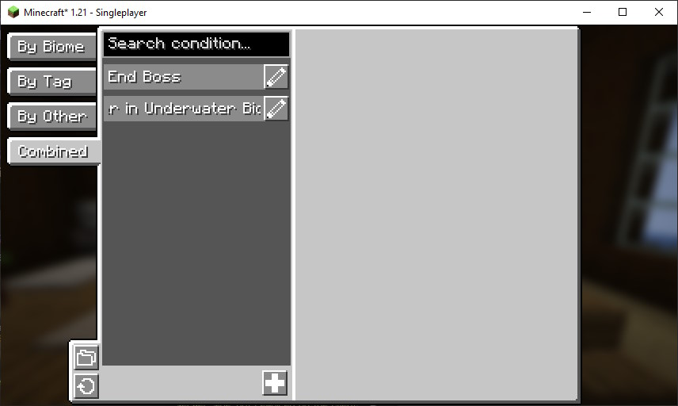
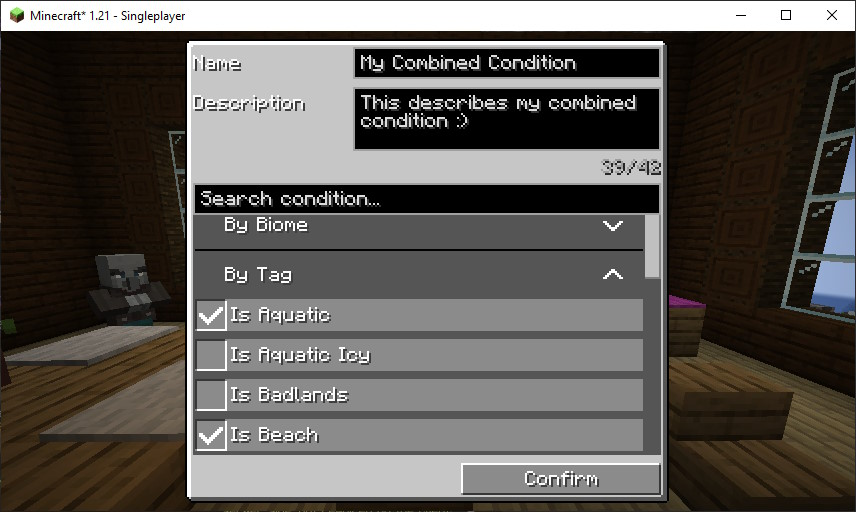

This mod aims to improve Minecraft's music system.

## Features

The mod lets you add custom tracks, removes the silence between songs, and gives you control over when each track plays.

### Custom Music

Add new songs simply by placing them into the mod’s music folder.

### Continuous Background Music

Normally, Minecraft has over 70 tracks, but due to the long pauses Minecraft puts between tracks, you'll only hear a few each hour. This mod cuts out those pauses, giving you a steady flow of background music.

### Control When a Track Should Play

You decide when specific songs play. For example, you could set underwater music to play outside ocean biomes or bring in spooky tracks at night. This lets you fine-tune the game’s atmosphere to match your desired vibe.

The mod uses conditions to determine when specific music tracks should play. A condition could be something like:
- "The player is in the plains biome."
- "The player is in a 'cold' biome."
- "The player is underwater."
- "A boss health bar is visible."

For each condition, you can select the tracks that will play whenever the condition is met.

You can combine conditions by selecting multiple individual ones. A combined condition is fulfilled only when all its parts are met, giving you more control over when certain tracks play and letting you fine-tune the music to match specific situations. For example, you could set up a combined condition that triggers when the player is in a cold forest at night.

## Compatibility

- Forge, Neoforge, Fabric: There is a version for each of the three major mod loaders.
- Client-Sided: Fully compatible with all servers.
- Other Mods:  Automatically detects music tracks, biomes, and biome tags from other mods.
- Minecraft Version: Currently supports Minecraft 1.21 only.

## Configuration

Configuration is managed in-game through the config menu. When in a world, press the "Open Config" key (default is "B") to access the configuration screen. The configuration auto-saves after exiting the screen.

The main screen is split into two parts. On the left, you can browse and select conditions by category using the tabs. When you select a condition, the right side displays its settings, where you can assign music tracks and more.

At the bottom left, there are two buttons:
- The "Reload" button reloads the config file and re-detects biomes and biome tags.
- The "Open Music Folder" button opens the folder where you can add music files. After adding files, press reload to make them appear in the config screen.

### Categories of Conditions

Conditions are grouped into four categories, accessible via the tabs on the left. Use the search field to locate specific conditions within each category.

#### Biome Conditions

There is a biome condition for each biome, triggered when the player stays in that biome for at least three seconds. This includes modded biomes.

#### Biome Tag Conditions

(Sub-)Biomes have tags that describe attributes like "cold," "dry," "snowy," or "overworld." These are useful for setting up tracks across dimensions or similar biomes. Biome tags from other mods are included.

#### Other Conditions

Most conditions in this category reflect Minecraft’s internal mechanics, plus a few additional ones for convenience. The “No Other Music Is Playing” condition is a fallback that’s always met (with the lowest priority) and can be used to have background music when no other condition is active.

#### Combined Conditions

Useful for specific situations, these conditions activate only when all their sub-conditions are met. For example:
- The player is on a cold hill at night (conditions "Is Cold," "Is Hill," "Is Night").
- The player is in the nether and in creative mode (conditions "Is Nether," "In Creative Mode").
- The player is under water in a cave (conditions "Is Cave", "Is Under Water").

### Configuring a Condition: Priorities and Music Tracks

When you select a condition, you can configure its priority level and assign music tracks to play whenever the condition is met.

#### Priority

The priority determines which conditions take precedence when multiple are active. Higher priority numbers mean greater importance. If a condition with a higher priority is met, conditions with lower priorities are ignored. For more details, refer to [this section](#how-the-mod-chooses-a-music-track).

#### Music Tracks

You can assign any number of music tracks to a condition. When the condition is met, one of these tracks is chosen randomly. Tracks are organized with custom songs at the top, followed by Minecraft’s background music and music discs, and finally tracks from other mods.

Use the search field to locate specific songs. Click the button next to a track to preview it.

### Adding and Editing a Combined Condition

The combined conditions tab includes an additional button to add a new condition, and each existing combined condition has an edit button beside it. Beyond this, configuring priorities and assigning music tracks works the same as it does for standard conditions.

When creating or editing a combined condition, a new screen will appear where you can customize its details. You can:
- Set a name for the condition.
- Add a short description.
- Select the sub-conditions that must all be met for the combined condition to activate.

## How the Mod Chooses a Music Track

The mod continuously monitors active conditions and determines which music to play by following these steps:
1. Identifies the highest priority among the met conditions.
2. Filters out any conditions that don’t match this priority.
3. Gathers all music tracks associated with the remaining conditions.
4. If the currently playing track isn’t in this list, it selects a new track randomly from the list.

Recently played tracks are tracked to avoid back-to-back repeats if possible.

## Current Limitations

- Custom music tracks can be added in the following formats: .wav, .mp3, .ogg (Vorbis), .flac, .aiff/.aif/.aifc, .au, .ape, .spx.
- The mod overrides Minecraft's default music system, so other mods relying on it may have compatibility issues.

## Upcoming Features

I still have some ideas I want to implement in the future.

- Structure Conditions: Like biome conditions but with structures like the stronghold.
- Individual Track Volume Control: This would allow you to adjust the volume of each track separately, which is helpful if your custom tracks have different audio levels.
- UI Improvements: Small tweaks, like an indicator to show which conditions have music assigned and which ones are currently active.
- Backports for Earlier Minecraft Versions: Backporting the mod to older versions is a bit tricky with the multiloader setup I have, but doing it modloader by modloader and version by version should be manageable, just time-consuming.
- Additional Settings:
  - Bringing back random silences between songs, for those who like the pauses in vanilla Minecraft.
  - Adjusting fade-in and fade-out times between the tracks.
- "Winamp": A mini-player you can have in a corner of the screen (or somewhere else) where you can see the current song, its duration etc. It could also have controls to e.g. pause or skip songs.
- Condition Grouping: A way to group conditions, so you can assign music to all of them at once, rather than setting each condition manually.
- Support for More Audio Formats: I’m looking into a Java library that could make it possible to play nearly any audio format, though switching to it would require some extra work.

## Modpack Creators

Feel free to use this mod in any modpack.

## Support

If you find a bug or have suggestions, please [create a ticket](https://github.com/Maki99999/music-by-biome/issues).

## License

This mod is available under the **MIT License**.
